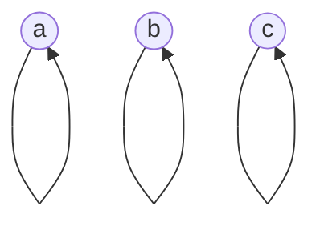
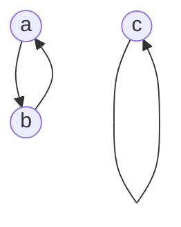
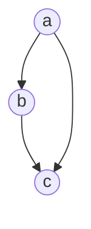

# Properties of Relations

In particular there are a few properties that we like to study when we talk about relations. These properties indicate the nature of the relation and can be used to classify them. Such as the Equivalence relation, and the Partial order relation.

## Equivalence relation

An equivalence relation is a relation that is reflexive, symmetric and transitive.

### Reflexive

A relation $R$ on a set $S$ is reflexive if for all $a \in S$, $(a, a) \in R$.

This can be seen in a graph as a self-loop on each node.

For example, the relation $R = \{(a, a), (b, b), (c, c)\}$ is reflexive.

In a matrix representation, we can see that the diagonal is filled with 1s.

$$
\begin{bmatrix}
1 & 0 & 0 \\
0 & 1 & 0 \\
0 & 0 & 1
\end{bmatrix}
$$

### Symmetric

A relation $R$ on a set $S$ is symmetric if for all $a, b \in S$, if $(a, b) \in R$ then $(b, a) \in R$.

This can be seen in a graph as a bidirectional edge between two nodes.

For example, the relation $R = \{(a, b), (b, a), (c, c)\}$ is symmetric.

In a matrix representation, we can see that the matrix is symmetric using the diagonal as the axis of symmetry.

$$
\begin{bmatrix}
0 & 1 & 0 \\
1 & 0 & 0 \\
0 & 0 & 1
\end{bmatrix}
$$

### Transitive

A relation $R$ on a set $S$ is transitive if for all $a, b, c \in S$, if $(a, b) \in R$ and $(b, c) \in R$ then $(a, c) \in R$.

This can be seen in a graph as a direct edge between any two nodes that are connected by a path.

For example, the relation $R = \{(a, b), (b, c), (a, c)\}$ is transitive.

In a matrix representation, we can see that if there is a 1 in the row of a node, then there is a 1 in the column of the node that is connected to it.

$$
\begin{bmatrix}
0 & 1 & 1 \\
0 & 0 & 1 \\
0 & 0 & 0
\end{bmatrix}
$$

## Equivalence class

An equivalence class is a set of elements that are related to each other by an equivalence relation.

For example

## Congruence mod m relation

A congruence mod m relation is an equivalence relation on the set of integers.

For example:

$$
R = \{(a, b) \in \mathbb{Z} \times \mathbb{Z} \mid a \equiv b \pmod{m}\}
$$

where, 
$$
a \equiv b \pmod{m} \ \ \longleftrightarrow \ \ a \pmod{m} = b \pmod{m}
$$

*Why?*

Because the congruence mod m relation is reflexive, symmetric and transitive.

*Reflexive demonstration:*

if
$$
a \equiv a \pmod{m} 
$$
then,
$$
a \pmod{m} = a \pmod{m}
$$

so it's reflexive.

*Symmetric demonstration:*

if
$$
a \equiv b \pmod{m}
$$
then,
$$
b \equiv a \pmod{m}
$$

so it's symmetric.

*Transitive demonstration:*

if
$$
a \equiv b \pmod{m}
$$
and
$$
b \equiv c \pmod{m}
$$
then,
$$
a \equiv c \pmod{m}
$$

so it's transitive.

## Partial order relation

A partial order relation is a relation that is reflexive, antisymmetric and transitive.

### Antisymmetric

A relation $R$ on a set $S$ is antisymmetric if for all $a, b \in S$, if $(a, b) \in R$ and $(b, a) \in R$ then $a = b$.

This means that in a graph, there are no bidirectional edges.

This also means that in a matrix, there is at least one entry wherein the symmetric entry is not equal.

$$
\begin{bmatrix}
0 & 0 & 0 \\
1 & 0 & 0 \\
0 & 0 & 1
\end{bmatrix}
$$

There are two reasonings we can use here:
- An edge points to and from the same node: self-loop and entry on the diagonal.
- Any edge exists: There is no bidirectional edge and the corresponding symmetric entry is the inverse.