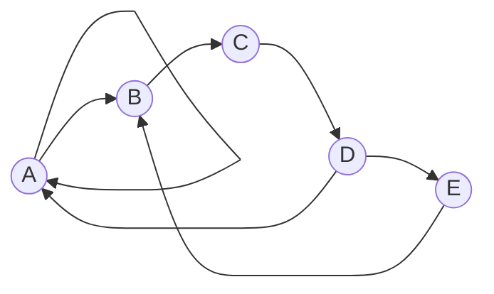
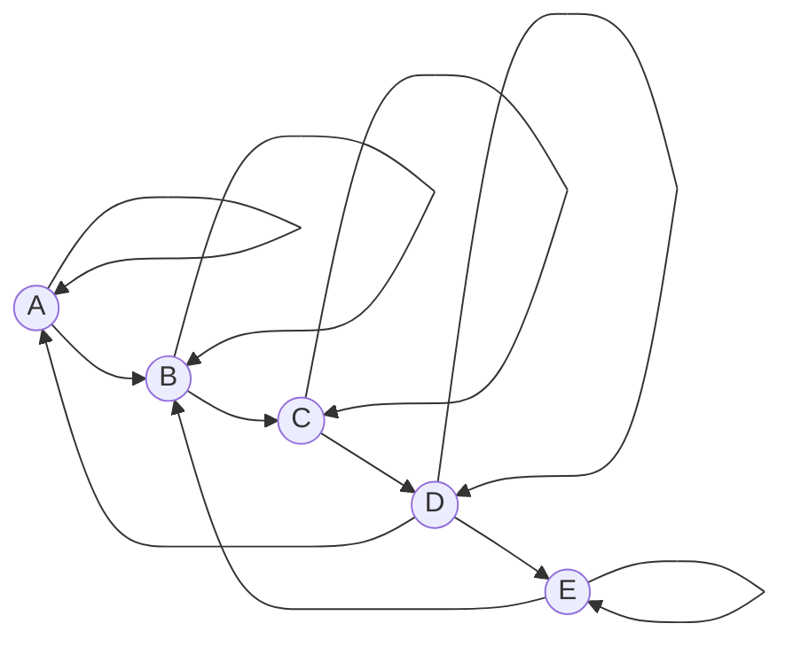

# Reflexive Closure
*How can we make a relation reflexive?*

## Mathematical Definition

$R$ is reflexive if $\forall \ a_i \in A, (a_i, a_i) \in R$.

## Matrix Representation

We know that the diagonal filled with 1s represents the reflexive closure of a relation.

Hence, the shortest way to make a relation reflexive is to fill the matrix diagonal with 1s.

For example, here is how we can make some relation reflexive in matrix form:
$$
\begin{bmatrix}
1 & 0 & 0 & 0 & 0 & 0 & 0  \\
0 & 0 & 0 & 0 & 0 & 0 & 0  \\
0 & 0 & 1 & 0 & 0 & 0 & 0  \\
0 & 0 & 0 & · & 0 & 0 & 0  \\
0 & 0 & 0 & 0 & · & 0 & 0 \\
0 & 0 & 0 & 0 & 0 & · & 0 \\
0 & 0 & 0 & 0 & 0 & 0 & 1 \\
\end{bmatrix}
\sim
\begin{bmatrix}
1 & 0 & 0 & 0 & 0 & 0 & 0  \\
0 & 1 & 0 & 0 & 0 & 0 & 0  \\
0 & 0 & 1 & 0 & 0 & 0 & 0  \\
0 & 0 & 0 & · & 0 & 0 & 0  \\
0 & 0 & 0 & 0 & · & 0 & 0 \\
0 & 0 & 0 & 0 & 0 & · & 0 \\
0 & 0 & 0 & 0 & 0 & 0 & 1 \\
\end{bmatrix}
$$

## Graph Representation

In the graph representation, we add a self-loop to each node.

For example, here is how we can make some relation reflexive in graph form:

Once we add the self-loops, the graph will look like this:

