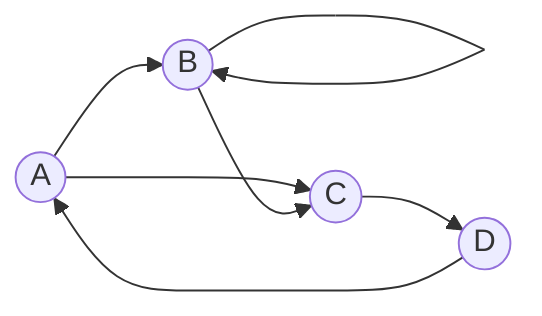

# Representations of Relations

For the following examples, we will consider the set $S = \{a, b, c, d\}$ and the binary relation 

$$
R = \{(a, b), (a, c), (b, b),(b, c), (c, d), (d, a)\}
$$

## Graph representation
As a visual diagram, this is very common in the CS and Engineering field. This allows us to study graph theory from a mathematical as well as a CS/Eng perspective.

If we assume a binary relation $R$ on a set $S$ as a set of 2-tuples like $(a_i, b_i)$, we can represent each tuple as a directed edge $a_i \longrightarrow b_i$, wherein $a_i$ and $b_i$ are nodes in the graph.

For example the relation $R$ can be represented graphically as:

## Matrix representation

A slightly less common representation due to the non-visual nature, but heavily used in graph implementations due to computational and mathematical simplicity.

Since we are mapping one set's elements to itself, we can let the rows of the matrix represent the source nodes and the columns, the destination nodes. 

Due to the binary nature of directed edges (either an edge, or none) between any two nodes, we can represent a graph or a relation as a matrix by placing $1$s wherever an edge is present, and $0$s wherever absent.

For example, the relation $R$ can be represented as a matrix:
$$
\begin{array}{c|cccc}
    & A & B & C & D \\
    \hline
    A & 0 & 1 & 1 & 0 \\
    B & 0 & 1 & 1 & 0 \\
    C & 0 & 0 & 0 & 1 \\
    D & 1 & 0 & 0 & 0 \\
\end{array}
\sim
 \begin{bmatrix}
    0 & 1 & 1 & 0 \\
    0 & 1 & 1 & 0 \\
    0 & 0 & 0 & 1 \\
    1 & 0 & 0 & 0 \\
\end{bmatrix}
$$
