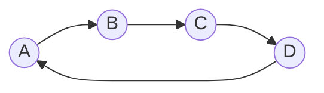
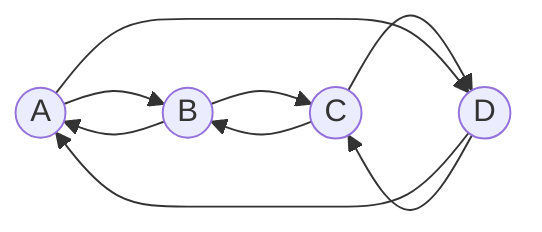

# Symmetric Closure
*How can we make a relation symmetric?*

## Mathematical Definition

$R$ is symmetric if $\forall \ (a_i, a_j) \in R \longrightarrow (a_j, a_i) \in R$.

## Matrix Representation

We know that the symmetric closure of a relation is when the matrix and its transpose are equal.

Hence, the shortest way to make a relation symmetric is to fill the matrix with its transpose.

For example, here is how we can make some relation symmetric in matrix form:

$$
\begin{bmatrix}
· & 1 & 0 & · \\
0 & · & · & · \\
1 & · & · & 0 \\
· & · & 0 & · \\
\end{bmatrix}
\sim
\begin{bmatrix}
· & 1 & 1 & · \\
1 & · & · & · \\
1 & · & · & 0 \\
· & · & 0 & · \\
\end{bmatrix}
$$

## Graph Representation

In the graph representation, we make sure that for every edge $(a_i, a_j)$, there is an edge $(a_j, a_i)$.

So we make any and all edges bidirectional.

For example, here is how we can make some relation symmetric in graph form:

Once we add the missing edges, the graph will look like this:
